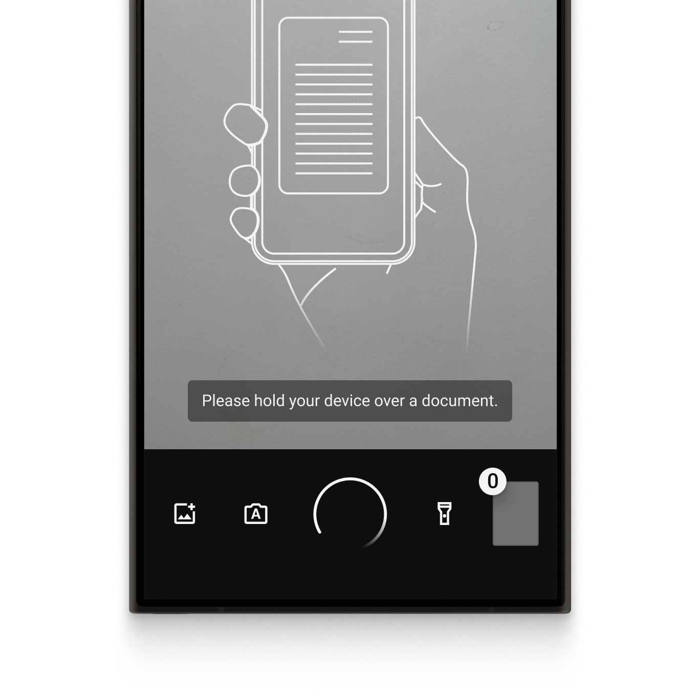
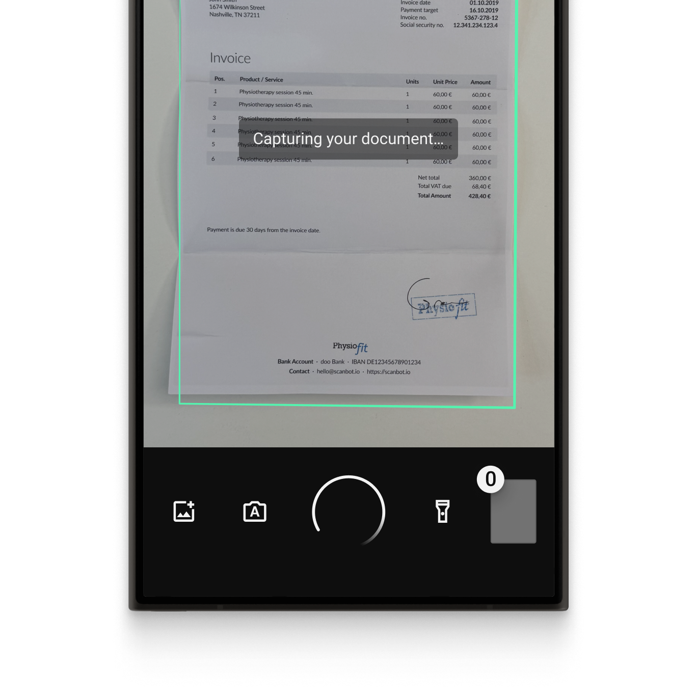
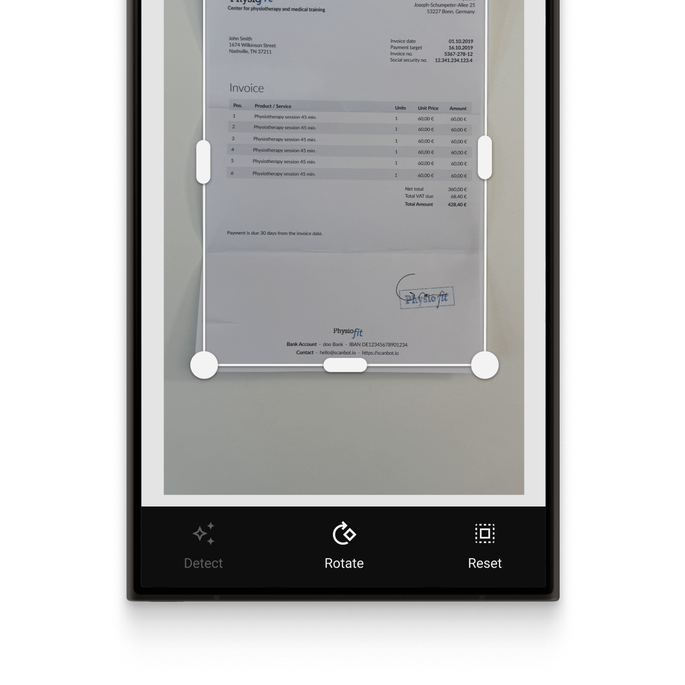

  

  

# Example app for the Scanbot Kotlin Multiplatform SDK
This example app shows how to integrate the [Scanbot Document Scanner SDK](https://deploy-preview-1545--sensational-tiramisu-56a165.netlify.app/kmp/document-scanner-sdk/introduction/?utm_source=github.com&utm_medium=referral&utm_campaign=dev_sites) for KMP. 

## What is the Scanbot SDK?

The Scanbot SDK is a set of high-level APIs that lets you integrate document scanning and data extraction functionalities into your mobile apps and websites. It runs on all common mobile devices and operates entirely offline. No data is transmitted to our or third-party servers.

With our Ready-To-Use UI (RTU UI) components, you can integrate the Scanbot SDK into your app in less than an hour.

💡 For more details about the Scanbot Document Scanner SDK, please check out our [documentation](https://deploy-preview-1545--sensational-tiramisu-56a165.netlify.app/kmp/document-scanner-sdk/introduction/?utm_source=github.com&utm_medium=referral&utm_campaign=dev_sites).

## Overview of the Scanbot SDK

### Document Scanner SDK

The Scanbot Kotlin Multiplatform Document Scanner SDK offers the following features:

* **User guidance**: Ease of use is crucial for large user bases. Our on-screen user guidance helps even non-tech-savvy users create perfect scans.

* **Automatic capture**: The SDK automatically captures the document when the device is optimally positioned over the document. This reduces the risk of blurry or incomplete document scans compared to manually triggered capture.

* **Automatic cropping**: Our document scanning SDK automatically straightens and crops scanned documents, ensuring high-quality document scan results.

* **Custom filters:** Every document scanning use case has specific image requirements. With the SDK’s custom filters, you can tailor the document scanning image output to your backend system. They include grayscale options, multiple binarizations, and other settings to optimize your document scanning for various document types.

* **Document Quality Analyzer:** This feature automatically rates the quality of the scanned pages from “very poor” to “excellent.” If the quality is below a specified threshold, the SDK prompts the user to rescan. 

* **Export formats:** The Scanbot Document Scanner SDK supports several output formats for exporting digitized documents (JPG, PDF, TIFF, and PNG). This ensures your downstream solutions receive the best format to store, print, or share the digitized document – or to process it further. 

|  |  |  |
| :-- | :-- | :-- |

## Additional information

### Free integration support

Need help integrating or testing our Document Scanner SDK? We offer [free developer support](https://docs.scanbot.io/support/?utm_source=github.com&utm_medium=referral&utm_campaign=dev_sites) via Slack, MS Teams, or email.

As a customer, you also get access to a dedicated support Slack or Microsoft Teams channel to talk directly to your Customer Success Manager and our engineers.

### Trial licensing and pricing

The Scanbot SDK examples will run one minute per session without a license. After that, all functionalities and UI components will stop working. 

To try the Scanbot SDK without a one-minute limit, you can request a free, no-strings-attached [7-day trial license](https://scanbot.io/trial/?utm_source=github.com&utm_medium=referral&utm_campaign=dev_sites). 

Alternatively, check out our [demo apps](https://scanbot.io/demo-apps/?utm_source=github.com&utm_medium=referral&utm_campaign=dev_sites) to test the SDK.

Our pricing model is simple: Unlimited document scanning for a flat annual license fee, full support included. There are no tiers, usage charges, or extra fees. [Contact](https://scanbot.io/contact-sales/?utm_source=github.com&utm_medium=referral&utm_campaign=dev_sites) our team to receive your quote. 

### Other supported platforms

Besides Kotlin Multiplatform, the Scanbot SDK is also available on most common cross-platform environments, such as React Native, Flutter, or .NET MAUI: 

* [Android](https://github.com/doo/scanbot-sdk-example-android) (native)
* [iOS](https://github.com/doo/scanbot-sdk-example-ios) (native)
* [JavaScript](https://github.com/doo/scanbot-sdk-example-web)
* [Flutter](https://github.com/doo/scanbot-sdk-example-flutter)
* [Capacitor & Ionic (Angular)](https://github.com/doo/scanbot-sdk-example-capacitor-ionic)
* [Capacitor & Ionic (React)](https://github.com/doo/scanbot-sdk-example-ionic-react)
* [Capacitor & Ionic (Vue.js)](https://github.com/doo/scanbot-sdk-example-ionic-vuejs)
* [Cordova & Ionic](https://github.com/doo/scanbot-sdk-example-ionic) 
* [.NET MAUI](https://github.com/doo/scanbot-sdk-maui-example)
* [React Native](https://github.com/doo/scanbot-sdk-example-react-native)
* [Xamarin](https://github.com/doo/scanbot-sdk-example-xamarin) & [Xamarin.Forms](https://github.com/doo/scanbot-sdk-example-xamarin-forms)
* [Windows](https://github.com/doo/scanbot-barcode-scanner-sdk-example-windows)
* [Linux](https://github.com/doo/scanbot-sdk-example-linux)
